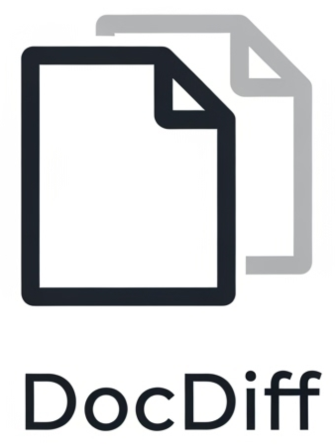

# Docdiff

<div align="center">
  <!-- Badges -->
  <a href="https://github.com/edmolima/docdiff/actions?query=workflow%3AContinuous+Integration">
    
  </a>
  <a href="https://crates.io/crates/docdiff">
    
  </a>
  <a href="https://github.com/edmolima/docdiff/blob/main/LICENSE">
    
  </a>
</div>

<div align="center">
  
</div>

**Docdiff** is a fast, intuitive CLI for comparing two files using advanced document distance algorithms. Built for developers, data scientists, and anyone who needs reliable file comparison, Docdiff makes it effortless to spot differences and measure similarity between documents.

---

## Features

- **Simple CLI**: Discoverable commands, clear help, and smart error messages.
- **Accurate Algorithms**: Uses modern document distance techniques for precise results.
- **Progress Bars**: Responsive indicators for large files.
- **Extensible**: Add new algorithms or commands with ease.
- **Performance**: Built in Rust for speed and reliability.
- **Clear Output**: Human-readable and machine-friendly results.

---


## Installation

**With Cargo:**

```sh
cargo install docdiff
```

**Pre-built Binaries:**

Download the latest release for your platform from [Releases](https://github.com/yourusername/docdiff/releases).

---


## Usage

**Docdiff only works with plain text files (.txt).**

Compare two text files:

```sh
docdiff diff file1.txt file2.txt
```

Show program info:

```sh
docdiff info
```

Get help:

```sh
docdiff --help
docdiff diff --help
```

---

## Example Output

```sh
$ docdiff diff file1.txt file2.txt
Comparing 'file1.txt' with 'file2.txt'...
[████████████████████████████████████████] 100%
Document distance: 0.123
Comparison finished!
```

---

## Algorithms

Docdiff uses advanced document distance algorithms. You can extend or customize algorithms by contributing to [`src/algorithms/`](src/algorithms/).

---

## Testing

Run all tests:

```sh
cargo test
```

---


## Contributing

Contributions are welcome! See [CONTRIBUTING.md](CONTRIBUTING.md) for guidelines.

---

## License

Docdiff is licensed under the [MIT License](LICENSE).

---


## Community & Support

- [GitHub Issues](https://github.com/yourusername/docdiff/issues) — Bug reports, feature requests, and questions.
- [Discussions](https://github.com/yourusername/docdiff/discussions) — Share ideas and get help.

---

## Quickstart

1. Install with Cargo or download a binary
2. Run `docdiff diff file1.txt file2.txt`
3. See the document distance and differences instantly

---

## Philosophy

Docdiff is designed for clarity, speed, and extensibility. Every detail—from error messages to output formatting—aims to make your workflow smoother and more productive.
